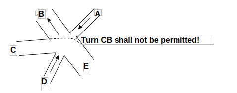
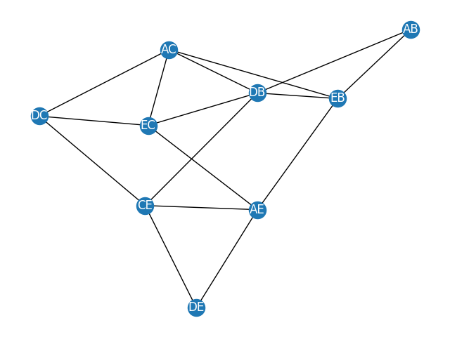
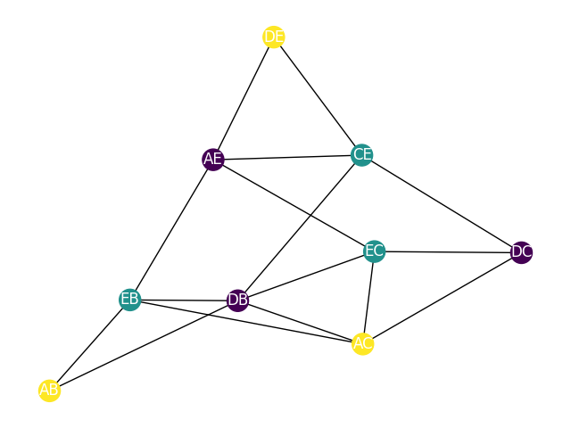

# Handout 1

Konrad Wojda, 9307820244

## Exercise 1



### Incompatible Turns Table

Firstly we should create a table that shows which turns can be allowed at once. I included only turns that are possible in terms of one-way streets.

| Turn | AB | AC | AE | CE | DB | DC | DE | EB | EC |
|------|----|----|----|----|----|----|----|----|----|
| AB   |    | ✅ | ✅ | ✅ | ❌ | ✅ | ✅ | ❌ | ✅ |
| AC   |    |    | ✅ | ✅ | ❌ | ❌ | ✅ | ❌ | ❌ |
| AE   |    |    |    | ❌ | ✅ | ✅ | ❌ | ❌ | ❌ |
| CE   |    |    |    |    | ❌ | ❌ | ❌ | ✅ | ✅ |
| DB   |    |    |    |    |    | ✅ | ✅ | ❌ | ❌ |
| DC   |    |    |    |    |    |    | ✅ | ✅ | ❌ |
| DE   |    |    |    |    |    |    |    | ✅ | ✅ |
| EB   |    |    |    |    |    |    |    |    | ✅ |
| EC   |    |    |    |    |    |    |    |    |    |

### Graph showing incompatible turns

Next, I created a graph which connects vertices of turns that cannot be allowed at once. 



### Colored graph

Next, I solved graph coloring problem in order to get the fewest groups of turns allowed at one time. I used python library called `networkx` to solve this problem. Code and output graph is given below.  

As a result I got three groups of turns, which are represented by different colors of vertices of the graph.  

First group is allowing cars to turn from D to B and C and also allows cars to turn from A to E.

Second group is allowing cars to turn from A to B and C and also allows cars to turn from D to E.

Third group is allowing cars to turn from E to B and C and also allows cars to turn from C to E.

We can see that all groups allow turns to B, C from one street and to E from second one.



### Code

```python
import networkx as nx
import matplotlib.pyplot as plt

G = nx.Graph()

edges = [
    ('AB', 'DB'),
    ('AB', 'EB'),
    ('AC', 'DB'),
    ('AC', 'DC'),
    ('AC', 'EB'),
    ('AC', 'EC'),
    ('AE', 'CE'),
    ('AE', 'DE'),
    ('AE', 'EB'),
    ('AE', 'EC'),
    ('CE', 'DB'),
    ('CE', 'DC'),
    ('CE', 'DE'),
    ('DB', 'EB'),
    ('DB', 'EC'),
    ('DC', 'EC'),
]
G.add_edges_from(edges)

plt.figure()
nx.draw(G, with_labels=True, font_color='white')
plt.title('Graph showing incompatible turns')
plt.show()
plt.savefig("graph1.png")

color_map = nx.coloring.greedy_color(G)
colors = [color_map[node] for node in G.nodes()]

plt.figure()
nx.draw(G, with_labels=True, node_color=colors, font_color='white')
plt.title('Colored graph')
plt.show()
plt.savefig("colored_graph.png")
```

## Exercise 2

Array: **[3, 41, 52, 26, 38, 57, 9, 49]**.

### Merge Sort

1. Split the array in half:

    `[3, 41, 52, 26]` , `[38, 57, 9, 49]`

2. Work on half 1:
    
    Split in half again, we get:  
        `[3, 41]` and `[52, 26]`
    
    And result again:

    `[3]` , `[41]` and  `[52]` , `[26]`

    We cannot split more, so next compare numbers and merge.  
    Result is:  
    `[3, 41]`     and   `[26, 52]`

    Next merge two above arrays.  
    Result is:  

    `[3, 26, 41, 52]`

3. Work on half 2:

    Split in half again, we get:  
        `[38, 57]` and `[9, 49]`
    
    And result again:

    `[38]` , `[57]` and  `[9]` , `[49]`

    We cannot split more, so next compare numbers and merge.  
    Result is:  
    `[38, 57]`     and   `[9, 49]`

    Next merge two above arrays.  
    Result is:  

    `[9, 38, 49, 57]`

4. Merge two left halves. Result is:

`[3, 9, 26, 38, 41, 49, 52, 57]`

### Insertion Sort

Iteration 0 (first element is becoming **"sorted part"**):  
**[3,** 41, 52, 26, 38, 57, 9, 49]

Iteration 1 (41 is compared to 3, no change):  
**[3, 41,** 52, 26, 38, 57, 9, 49]

Iteration 2 (52 is compared to 41 and 3, no change):  
**[3, 41, 52,** 26, 38, 57, 9, 49]

Iteration 3 (26 is compared to 52, 41, 3 and inserted on second place):  
**[3, 26, 41, 52,** 38, 57, 9, 49]

Iteration 4 (38 is compared to 52, 41, 26, 3):  
**[3, 26, 38, 41, 52,** 57, 9, 49]

Iteration 5 (57 is compared to 52, no change):  
**[3, 26, 38, 41, 52, 57,** 9, 49]

Iteration 6 (9 is compared to 57, 52, 41, 38, 26, 3):  
**[3, 9, 26, 38, 41, 52, 57,** 49]

Iteration 7 (49 is compared to 57, 52, 41, 38, 26, 9, 3):  
**[3, 9, 26, 38, 41, 49, 52, 57]**

The sorted array using Insertion Sort is: `[3, 9, 26, 38, 41, 49, 52, 57]`.

## Exercise 3

```
INSERTION-SORT(A)
1  for j ← 2 to length[A]
2      do key ← A[j]
3      ▷ Insert A[j] into the sorted sequence A[1..j-1].
4      i ← j - 1
5      while i > 0 and A[i] < key
6          do A[i + 1] ← A[i]
7              i ← i - 1
8      A[i + 1] ← key
```

Changes: `A[i] > key` changed to `A[i] < key`. Now arrays will be sorted in decreasing order.

## Exercise 4

This problem is known as Longest increasing subsequence. Based on online sources I created a small python code that computes this subsequence. Answer is given below.
Sources:  
* https://en.wikipedia.org/wiki/Longest_increasing_subsequence
* https://www.geeksforgeeks.org/longest-increasing-subsequence-dp-3/
* http://algorytmika.wikidot.com/najdluzszy-podciag-rosnacy

### Code

```python
def longest_increasing_subsequence(arr):
    lis_lengths = [1] * len(arr)
    previous = [-1] * len(arr)

    for i in range(1, len(arr)):
        for j in range(i):
            if arr[i] > arr[j] and lis_lengths[i] < lis_lengths[j] + 1:
                lis_lengths[i] = lis_lengths[j] + 1
                previous[i] = j

    max_length_index = lis_lengths.index(max(lis_lengths))

    lis = []
    current_index = max_length_index
    while current_index != -1:
        lis.append(arr[current_index])
        current_index = previous[current_index]

    lis.reverse()

    return lis

arr = [9, 44, 32, 12, 7, 42, 34, 92, 35, 37, 41, 8, 20, 27, 83, 64, 61, 28, 39, 
       93, 29, 17, 13, 14, 55, 21, 66, 72, 23, 73, 99, 1, 2, 88, 77, 3, 65, 83, 
       84, 62, 5, 11, 74, 68, 76, 78, 67, 75, 69, 70, 22, 71, 24, 25, 26]

lis = longest_increasing_subsequence(arr)

print("Longest increasing subsequence:", lis)
print(len(lis))
```

### Answer

Longest increasing subsequence: [9, 32, 34, 35, 37, 41, 64, 66, 72, 73, 77, 83, 84] which length is 13.

9 ~~44~~ 32 ~~12~~ ~~7~~ ~~42~~ 34 ~~92~~ 35 37 41 ~~8~~ ~~20~~ ~~27~~ ~~83~~ 64 ~~61~~ ~~28~~ ~~39~~ ~~93~~ ~~29~~ ~~17~~ ~~13~~ ~~14~~ ~~55~~
~~21~~ 66 72 ~~23~~ 73 ~~99~~ ~~1~~ ~~2~~ ~~88~~ ~~77~~ ~~3~~ ~~65~~ 83 84 ~~62~~ ~~5~~ ~~11~~ ~~74~~ ~~68~~ ~~76~~ ~~78~~ ~~67~~ ~~75~~ ~~69~~ ~~70~~ ~~22~~
~~71~~ ~~24~~ ~~25~~ ~~26~~ 