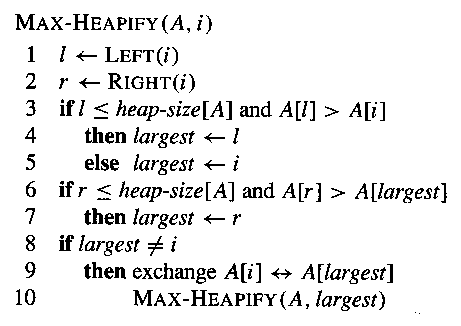

---
header-includes:
  - \usepackage[utf8]{inputenc}
  - \usepackage[T1]{fontenc}
---

# Algorithms Analysis - Handout 1

Konrad Wojda, 9307820244

## Exercise 1

1. $x^2 = O(x^3)$

2. $x^3 = O(x^2)$

3. $5x^3 + 3x^2 = \Omega(x^4)$

4. $3x^2 + 5x + 2 = \Theta(x^2)$

5. $2^{n+1} = O(2^n)$

6. $3^n = O(2^n)$

7. $3^n = \Omega(2^n)$


### 1. **True**.

Big-O notation represents an upper bound on the growth of a function. Since $x^3$ grows faster than $x^2$, $x^2$ is $O(x^3)$.

$$
x^2 \leq x^3 \cdot c
$$

$$
\frac{1}{x} \leq c
$$

As $x \to \infty$, $\frac{1}{x} \to 0$, so the equation is true for any $c \geq 0$ and $x_0 \geq 1$.

### 2. **False**.
$x^3$ grows faster than $x^2$, so $x^3$ cannot be bounded above by $x^2$.

$$
x^3 \leq x^2 \cdot c
$$

$$
x \leq c
$$

This inequality is false for large $x$ because $x$ grows without bound.

### 3. **False**.

The term $\Omega(x^4)$ suggests a lower bound, but $5x^3 + 3x^2$ grows slower than $x^4$. Hence, it is not bounded below by x^4.

$$
5x^3 + 3x^2 \geq c \cdot x^4
$$

$$
\frac{5}{x} + \frac{3}{x^2} \geq c
$$

As $x \to \infty$, $\frac{5}{x} + \frac{3}{x^2} \to 0$, so there is no such $c$ that inequality would be true.


### 4. **True**.

The polynomial $3x^2 + 5x + 2$ has a dominant term of $x^2$ as $x \to \infty$. Therefore, it has both upper and lower bounds that are proportional to x^2, making it $\Theta(x^2)$.

$$
c_1 \cdot x^2 \leq 3x^2 + 5x + 2 \leq c_2 \cdot x^2
$$

We can ignore terms $5x + 2$ for large $x$, for which both lower and upper bounds can be satisfied by choosing constants.

For example $c_1 = 1, c_2 = 4$

### 5. **False**.
$2^{n+1} = 2 \cdot 2^n$, which grows faster than $2^n$. Thus, $2^{n+1}$ is not $O(2^n)$.

$$
2 \cdot 2^n \leq c \cdot 2^n
$$

divide by $2^n$

$$
2 \leq c
$$

Which implies that the statement is false.

### 6. **False**.
$3^n$ grows exponentially faster than $2^n$, so it cannot be bounded above by $2^n$. Therefore, the statement is false.

$$
3^n \leq c \cdot 2^n
$$

divice by $2^n$

$$
(\frac{3}{2})^n \leq c
$$

$(\frac{3}{2})^n$ grows exponentially, so this inequality would be false for large $n$

### 7. **True**.

Since $3^n$ grows faster than $2^n$, $3^n$ is indeed bounded below by $2^n$, making this statement true.

$$
3^n \geq c \cdot 2^n
$$

divice by $2^n$

$$
(\frac{3}{2})^n \geq c
$$

$(\frac{3}{2})^n$ grows exponentially, which makes this inequality true for lagre $n$ and any $c \geq 1$.

## Exercise 2



```
MAX-HEAPIFY(A, i)
while (true)
    l = LEFT(i)
    r = RIGHT(i)
    if l <= heap-size[A] and A[l] > A[i]
        largest = l
    else 
        largest = i
    if r <= heap-size[A] and A[r] > A[largest]
        largest = r
    if largest != i
        exchange A[i] with A[largest]
        i = largest
    else
        break
end
```

## Exercise 3