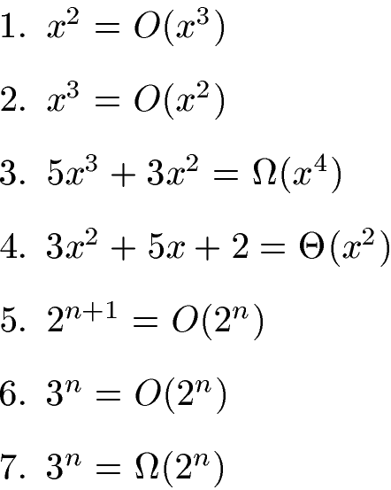

# Algorithms Analysis - Handout 1

Konrad Wojda, 9307820244

## Exercise 1



### 1. **True**.

Big-O notation describes an upper bound on the growth of a function. Since x^3 grows faster than x^2 for large values of x, x^2 is O(x^3).

### 2. **False**.
x^3 grows faster than x^2, so x^3 cannot be bounded above by x^2. Hence, this statement is false.

### 3. **False**.

The term Ω(x^4) suggests a lower bound, but 5x^3 + 3x^2 grows slower than x^4. Hence, it is not bounded below by x^4.

### 4. **True**.

The polynomial 3x^2 + 5x + 2 has a dominant term of x^2 as x approaches infinity. Therefore, it has both upper and lower bounds that are proportional to x^2, making it Θ(x^2).

### 5. **False**.
 2^{n+1} = 2 * 2^n, which grows faster than 2^n. Thus, 2^{n+1} is not O(2^n).

### 6. **False**.
 3^n grows exponentially faster than 2^n, so it cannot be bounded above by 2^n. Therefore, the statement is false.

### 7. **True**.

Since 3^n grows faster than 2^n, 3^n is indeed bounded below by 2^n, making this statement true.

## Exercise 2


```
MAX-HEAPIFY(A, i)
while (true)
    l = LEFT(i)
    r = RIGHT(i)
    if l <= heap-size[A] and A[l] > A[i]
        largest = l
    else 
        largest = i
    if r <= heap-size[A] and A[r] > A[largest]
        largest = r
    if largest != i
        exchange A[i] with A[largest]
        i = largest
    else
        break
end
```

## Exercise 3