# Algorithms Analysis - Handout 4

Konrad Wojda, 9307820244

## Exercise 1

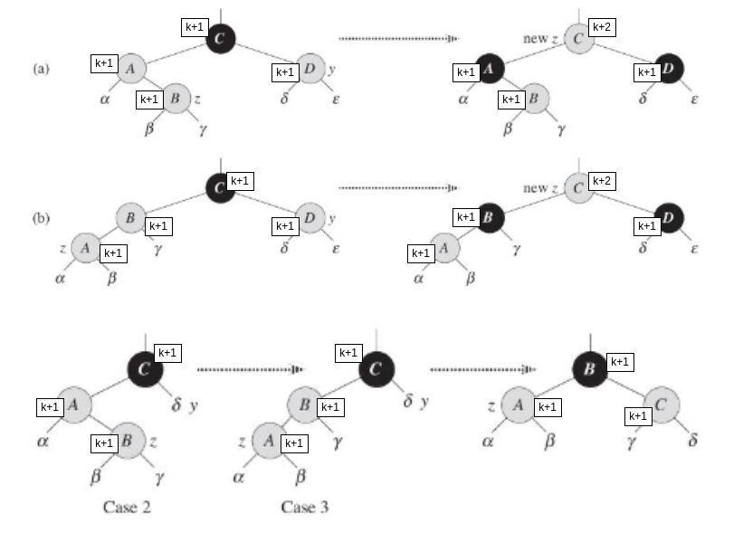

## Exercise 2
Add 41:  

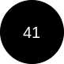

Add 38:

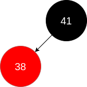

Add 31:

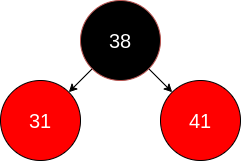

Add 12:

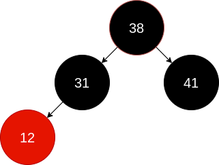

Add 19:

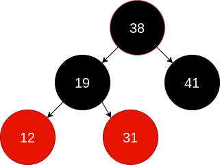

Add 8:

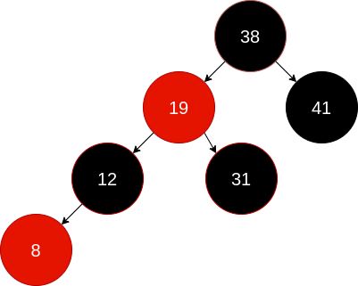

## Exercise 3

Starting point:

Delete 8:

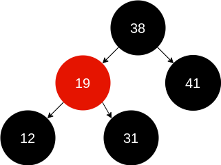

Delete 19:

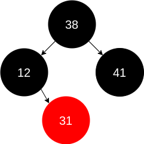

Delete 12:

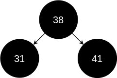

Delete 31:

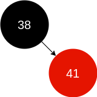

Delete 38:

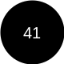

Delete 41:

empty tree.
