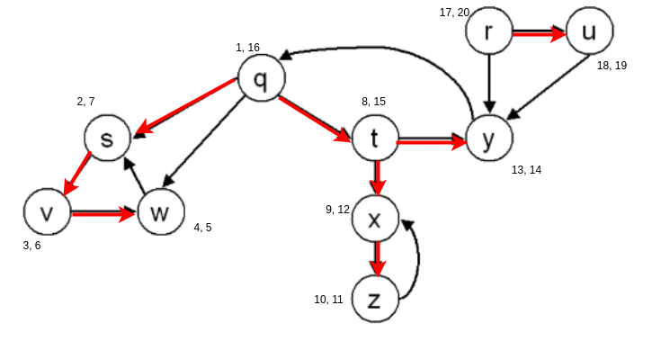

# Algorithms Analysis - Handout 5

Konrad Wojda, 9307820244

## Exercise 1

|Vertex| d | π     |
|------|---|-------|
| u    | 0 | null  |
| t    | 1 | u     |
| y    | 1 | u     |
| x    | 1 | u     |
| w    | 2 | t     |
| s    | 3 | w     |
| r    | 4 | s     |
| v    | 5 | r     |

## Exercise 2

### Directed

(i,j) | White | Gray | Black
:----:|:----:|:----:|:----:
White | Tree, Back, Forward, Cross | Back, Cross | Cross
Gray | Tree, Forward | Tree, Forward, Back | Tree, Forward, Cross
Black |  None  |  Back | Tree, Back, Forward, Cross

### Undirected

(i,j) | White | Gray | Black
:----:|:----:|:----:|:----:
White | Tree, Back | Tree, Back | None
Gray | Tree, Back | Tree, Back | Tree, Back
Black |  None  |  Tree, Back | Tree, Back

## Exercise 3

### Output of the algorithm:

Numbers next to the nodes are (discovery time, finishing time).

### Classification of edges:

**Tree edges:** (q, s), (s, v), (v, w), (q, t), (t, x), (x, z), (t, y), (r, u)

**Back edges:** (w, s), (z, x), (y, q)

**Forward edges:** (q, w)

**Cross edges:** (r, y), (u, y)
