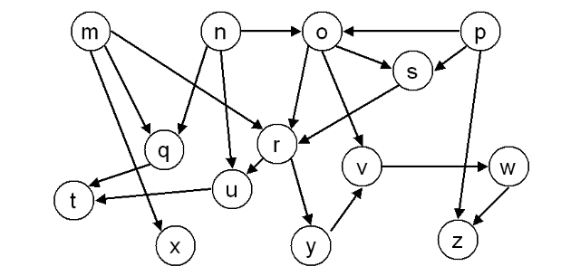
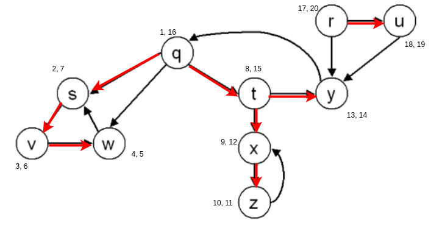
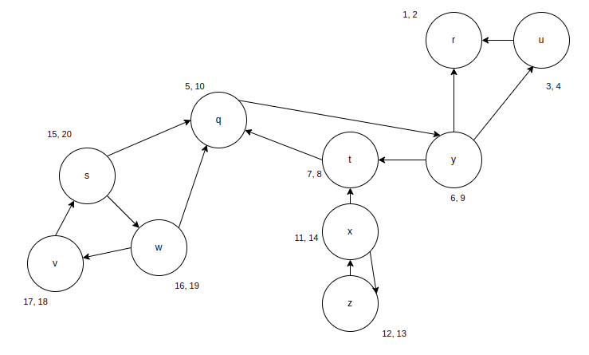
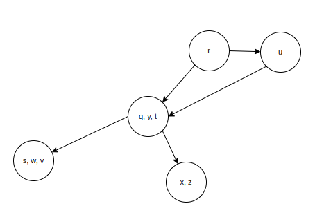

# Algorithms Analysis - Handout 6

Konrad Wojda, 9307820244

# Exercise 1

Output of topological sort of the graph above will be:  

**[ p, n, o, s, m, x, q, r, y, v, w, z, u, t  ]**

# Exercise 2

I can use discovery and finishing times from exercise in previous homework:

Then, I can compute transposed graph and run DFS on it, considering vertices in decreasing order of finishing times from previous run, giving the following result:

Which gives us separate groups of strongly connected components as follows:

**{r} , {u} , {q, y, t} , {x, z} , {s, w, v}**

# Exercise 3

The number of strongly connected components (SCCs) in a graph either **decreases** or **remains the same** when a new edge is added.

- Number of SCCs **decreases**:  
If the new edge connects two previously separate SCCs, merging them into one.

- Number of SCCs **remains the same**:  
If the new edge connects two vertices already in the same SCC.
